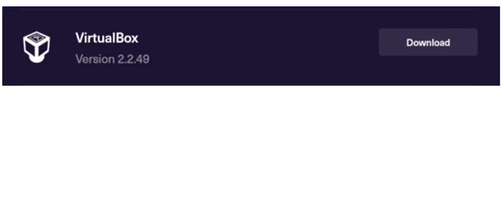
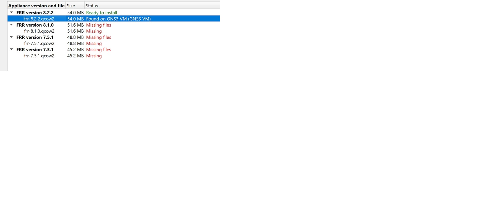

# Лабораторная работа №4
# Подготовка экспериментального стенда GNS3

**Выполнил(а):** [Ваше ФИО]
**Группа:** [Ваша группа]

---

## 1. Формулировка задания работы

1. Установить GNS3-all-in-one и GNS3 VM, проверить корректность запуска
2. Импортировать в GNS3 образ маршрутизатора FRR
3. Импортировать в GNS3 образ маршрутизатора VyOS

---

## 2. Описание результатов выполнения задания

### 2.1. Установка GNS3-all-in-one и GNS3 VM

**Рис. 4.1: Загрузка файлов GNS3**

*Загрузка необходимых файлов для установки: GNS3-all-in-one версии 2.2.54 и виртуальной машины GNS3 VM версии 3.0.5 для VirtualBox*

**Рис. 4.2: Запуск мастера установки GNS3**

*Запуск установочного мастера GNS3 версии 2.2.49. Начало процесса установки с приветственным окном*

**Рис. 4.3: Выбор компонентов для установки**

*Выбор компонентов для установки: отмечены MSVC Runtime, GNS3 Desktop, GNS3 WebClient, GNS3 VM и Tools - полный комплект для работы*

**Рис. 4.4: Выбор типа виртуальной машины**

*Выбор VirtualBox в качестве платформы виртуализации для работы с GNS3 VM*

**Рис. 4.5: Импорт виртуальной машины GNS3 VM**

*Импорт виртуальной машины GNS3 VM в VirtualBox. Выбрана политика генерации новых MAC-адресов для всех сетевых адаптеров*

**Рис. 4.6: Включение вложенной виртуализации**

*Включение вложенной виртуализации через командную строку с помощью команды: `VBoxManage modifyvm "GNS3 VM" --nested-hw-virt on`*

**Рис. 4.7: Настройка сетевого адаптера**

*Настройка сетевого адаптера 1 в VirtualBox: выбран тип подключения "Виртуальный адаптер хоста" с использованием VirtualBox Host-Only Ethernet Adapter*

**Рис. 4.8: Настройка DHCP-сервера**

*Настройка параметров DHCP-сервера для виртуальной сети: установлен диапазон адресов от 192.168.56.101 до 192.168.56.254*

**Рис. 4.9: Запуск GNS3 VM**

*Успешный запуск виртуальной машины GNS3 VM. Отображение информации о системе: IP-адрес 192.168.56.2, порт 80, доступ к web-UI*

**Рис. 4.10: Настройка локального сервера GNS3**

*Настройка локального сервера GNS3: указан IP-адрес привязки 192.168.56.1 (из подсети VirtualBox) и порт 3000*

---

### 2.2. Импорт образа маршрутизатора FRR

**Рис. 4.11: Создание нового шаблона**

*Создание нового шаблона устройства в GNS3. Выбран рекомендуемый способ - установка образа с GNS3 сервера*

**Рис. 4.12: Выбор образа FRR**

*Выбор образа маршрутизатора FRR (FRRouting) из списка доступных устройств в маркетплейсе GNS3*

**Рис. 4.13: Выбор версии FRR 8.2.2**

*Выбор версии FRR 8.2.2 для установки. Образ готов к установке, файл найден на GNS3 VM*

**Рис. 4.14: Завершение установки FRR**

*Завершение установки образа FRR. Отображение инструкций по использованию: учетные данные root/root, команда 'Vtpit' для возврата в консоль*

**Рис. 4.15: Настройка параметров FRR**

*Настройка параметров образа FRR: включена опция автоматического создания config disk на HDD, выбран режим завершения работы через ACPI сигнал*

---

### 2.3. Импорт образа маршрутизатора VyOS

**Рис. 4.16: Выбор версии VyOS**

*Выбор версии VyOS 1.3.3 для установки. Образ готов к установке, требуется дополнительный файл empty8G.qcow2*

**Рис. 4.17: Успешная установка образов**

*Успешно установленные образы маршрутизаторов: FRR 8.2.2 и VyOS 1.3.3 отображаются в списке доступных устройств GNS3*

---

## 3. Выводы

В ходе лабораторной работы был успешно выполнен комплекс задач по подготовке экспериментального стенда GNS3:

1. **Установлено программное обеспечение**: GNS3-all-in-one версии 2.2.49 и виртуальная машина GNS3 VM версии 3.0.5
2. **Настроена виртуализация**: Включена вложенная виртуализация в VirtualBox, настроены сетевые адаптеры и DHCP-сервер
3. **Проверена работоспособность**: Обеспечено стабильное подключение между клиентской частью GNS3 и серверной VM по адресу 192.168.56.2
4. **Импортированы образы маршрутизаторов**: Успешно добавлены FRR 8.2.2 и VyOS 1.3.3 с настройкой параметров запуска и завершения
5. **Создана сетевая инфраструктура**: Настроена host-only сеть 192.168.56.0/24 для взаимодействия между компонентами

**Стенд полностью готов** к использованию для моделирования сетевых топологий, проведения экспериментов с маршрутизацией и выполнения последующих лабораторных работ по сетевым технологиям.