---
## Front matter
lang: ru-RU
title: Лабораторная работа №1
subtitle: Операционные системы
author:
  - Дворкина Е. В., НКАбд-01-22
institute:
  - Российский университет дружбы народов, Москва, Россия
date: 18 февраля 2023

## i18n babel
babel-lang: russian
babel-otherlangs: english

## Formatting pdf
toc: false
toc-title: Содержание
slide_level: 2
aspectratio: 169
section-titles: true
theme: metropolis
header-includes:
 - \metroset{progressbar=frametitle,sectionpage=progressbar,numbering=fraction}
 - '\makeatletter'
 - '\beamer@ignorenonframefalse'
 - '\makeatother'
---

## Цель работы

Целью данной работы является приобретение практических навыков установки операционной системы на виртуальную машину, настройки минимально необходимых для дальнейшей работы сервисов.

## Задание

1. Работа с операционной системой после установки
2. Установка драйверов для VirtualBox
3. Настройка раскладки клавиатуры
4.  Подключение общей папки
5. Установка программного обеспечения для создания документации
6. Дополнительные задания

## Работа с операционной системой после установки

- Запускаю виртуальную машину
- Нажимаю комбинацию win + Enter для запуска терминала
- Переключившись на роль супер-пользователя, обновляю все пакеты (рис. 1).

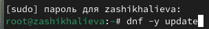{#fig:001 width=60%}

## Работа с операционной системой после установки

Устанавливаю программы для удобства в консоли (рис. 2).

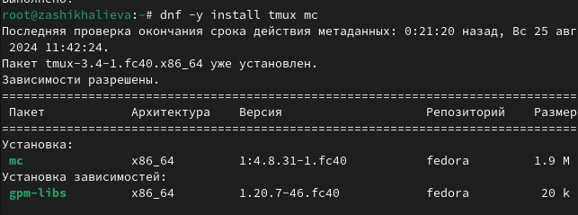{#fig:002 width=60%}

## Работа с операционной системой после установки

Установливаю программное обеспечения для автоматического обновления (рис. 3).

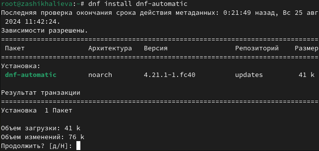{#fig:003 width=55%}

## Работа с операционной системой после установки

Задаю необходимую конфигурацию файла /etc/dnf/automatic.conf (рис. 4).

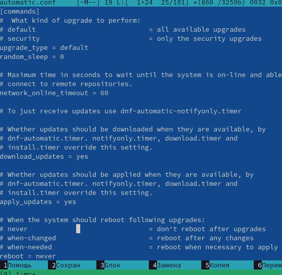{#fig:004 width=55%}

## Работа с операционной системой после установки

Запускаю таймер командой (рис. 5).

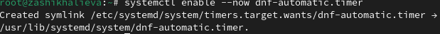{#fig:005 width=60%}

## Работа с операционной системой после установки

- Отключаю SELinux, редактируя строчку в файле /etc/selinux/config SELINUX=permissive (рис. 6). 
- А после перезагружаем систему.

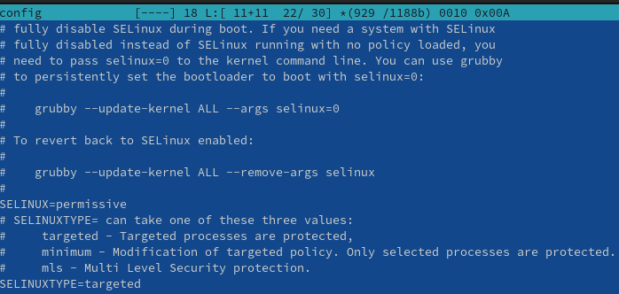{#fig:006 width=55%}

## Установка драйверов для VirtualBox

- Запускаю tmux
- Переключаюсь на роль супер-пользователя
- Устанавливаю средства разработки (рис. 7).

{#fig:007 width=55%}

## Установка драйверов для VirtualBox
 
 Устанавливаю пакет dkms (рис. 8).

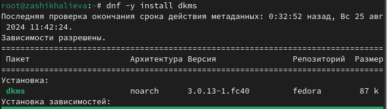{#fig:009 width=50%}

## Установка драйверов для VirtualBox

В меню виртуальной машины подключаю образ диска гостевой ОС и примонтирую диск с помощью утилиты mount (рис. 9).

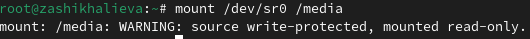{#fig:010 width=60%}

## Установка драйверов для VirtualBox

- Устанавливаю драйвера (рис. 10). 
- Перезагружаю машину.

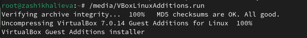{#fig:011 width=55%}

## Настройка раскладки клавиатуры

- Запускаю tmux.
- Переключаюсь на супер-пользователя.
- Редактирую конфигурационный файл /etc/X11/xorg.conf.d/00-keyboard.conf (рис. 11). А после перезагружаю машину.

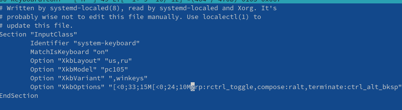{#fig:012 width=60%}

## Подключение общей папки
- Запускаю tmux. 
- Переключаюсь на супер-пользователя
- Добавляю пользователя в группу vboxsf (рис. 12)

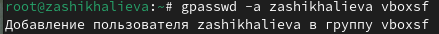{#fig:013 width=70%}

## Подключение общей папки

- В хостовой системе подключаю разделяемую папку (рис. 13). 
- Перезагружаю машину

{#fig:017 width=70%}

## Установка программного обеспечения для создания документации

- Скачиваю pandoc и pandoc-crossref.
- Перемещаю pandoc и pandoc-crossref в папку /usr/local/bin (рис. 14).

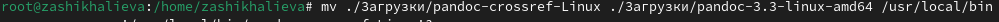{#fig:023 width=70%}

## Установка программного обеспечения для создания документации

Устанавливаю дистрибутив texlive (рис. 15).

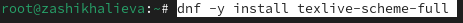{#fig:025 width=70%}

## Выводы

При выполнении данной лабораторной работы я приобрела практические навыки установки операционной системы на виртуальную машину, а так же сделала настройки минимально необходимых для дальнейшей работы сервисов.

## Ответы на контрольные вопросы

1. Учетная запись содержит следующую информацию:
- идентификатор пользователя (UID)
- идентификатор группы (GID)
- полное имя 
- домашний каталог
- оболочка входа
2. Команда для:
- Получения справки по команде - man mv
- Перемещения по файловой системе - cd ../
- Просмотра сожердимого каталога - ls
- Определения объёма каталога - du /home/zashikhalieva/Загрузки
- Создания/удаления каталогов - mkdir newdir/ rmdir newdir
- Создания/удаления файлов - touch 1.txt / rm 1.txt
- Для задания определенных файлов - chmod 777 1.txt
- Для просмотра истории команд - history
3. Файловая система - многоуровневая упорядоченная совокупность файлов и каталогов, хранящаяся на внешнем носителе.
   * NTFS -  Повышенная надежность, повышенный уровень безопасности, поддержка больших томов. 
   * ext4 - журналирование, поддержка шифрования
4. Команда для просмотра, какие файловые системы подмонтированы - df
5. Удалить зависший процесс можно через команду kill
  
