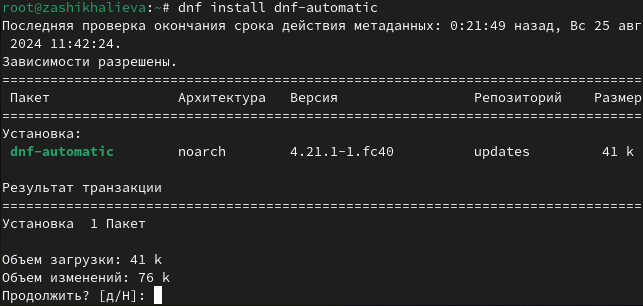
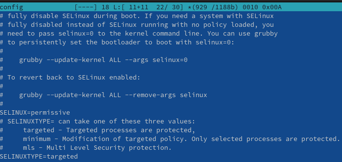

--
## Front matter
title: "Отчет по лабораторной работе №1"
subtitle: "Операционные системы"
author: "Шихалиева Зурият Арсенова"

## Generic otions
lang: ru-RU
toc-title: "Содержание"

## Bibliography
bibliography: bib/cite.bib
csl: pandoc/csl/gost-r-7-0-5-2008-numeric.csl

## Pdf output format
toc: true # Table of contents
toc-depth: 2
lof: true # List of figures
lot: true # List of tables
fontsize: 12pt
linestretch: 1.5
papersize: a4
documentclass: scrreprt
## I18n polyglossia
polyglossia-lang:
  name: russian
  options:
	- spelling=modern
	- babelshorthands=true
polyglossia-otherlangs:
  name: english
## I18n babel
babel-lang: russian
babel-otherlangs: english
## Fonts
mainfont: PT Serif
romanfont: PT Serif
sansfont: PT Sans
monofont: PT Mono
mainfontoptions: Ligatures=TeX
romanfontoptions: Ligatures=TeX
sansfontoptions: Ligatures=TeX,Scale=MatchLowercase
monofontoptions: Scale=MatchLowercase,Scale=0.9
## Biblatex
biblatex: true
biblio-style: "gost-numeric"
biblatexoptions:
  - parentracker=true
  - backend=biber
  - hyperref=auto
  - language=auto
  - autolang=other*
  - citestyle=gost-numeric
## Pandoc-crossref LaTeX customization
figureTitle: "Рис."
tableTitle: "Таблица"
listingTitle: "Листинг"
lofTitle: "Список иллюстраций"
lotTitle: "Список таблиц"
lolTitle: "Листинги"
## Misc options
indent: true
header-includes:
  - \usepackage{indentfirst}
  - \usepackage{float} # keep figures where there are in the text
  - \floatplacement{figure}{H} # keep figures where there are in the text
---

## Цель работы

Целью данной работы является приобретение практических навыков установки операционной системы на виртуальную машину, настройки минимально необходимых для дальнейшей работы сервисов.

## Задание

1. Работа с операционной системой после установки
2. Установка драйверов для VirtualBox
3. Настройка раскладки клавиатуры
4.  Подключение общей папки
5. Установка программного обеспечения для создания документации
6. Дополнительные задания

## Работа с операционной системой после установки

- Запускаю виртуальную машину
- Нажимаю комбинацию win + Enter для запуска терминала
- Переключившись на роль супер-пользователя, обновляю все пакеты (рис. 1).

{#fig:001 width=60%}

## Работа с операционной системой после установки

Устанавливаю программы для удобства в консоли (рис. 2).

{#fig:002 width=60%}

## Работа с операционной системой после установки

Установливаю программное обеспечения для автоматического обновления (рис. 3).

{#fig:003 width=55%}

## Работа с операционной системой после установки

Задаю необходимую конфигурацию файла /etc/dnf/automatic.conf (рис. 4).

{#fig:004 width=55%}

## Работа с операционной системой после установки

Запускаю таймер командой (рис. 5).

{#fig:005 width=60%}

## Работа с операционной системой после установки

- Отключаю SELinux, редактируя строчку в файле /etc/selinux/config SELINUX=permissive (рис. 6). 
- А после перезагружаем систему.

{#fig:006 width=55%}

## Установка драйверов для VirtualBox

- Запускаю tmux
- Переключаюсь на роль супер-пользователя
- Устанавливаю средства разработки (рис. 7).

{#fig:007 width=55%}

## Установка драйверов для VirtualBox
 
 Устанавливаю пакет dkms (рис. 8).

{#fig:009 width=50%}

## Установка драйверов для VirtualBox

В меню виртуальной машины подключаю образ диска гостевой ОС и примонтирую диск с помощью утилиты mount (рис. 9).

{#fig:010 width=60%}

## Установка драйверов для VirtualBox

- Устанавливаю драйвера (рис. 10). 
- Перезагружаю машину.

{#fig:011 width=55%}

## Настройка раскладки клавиатуры

- Запускаю tmux.
- Переключаюсь на супер-пользователя.
- Редактирую конфигурационный файл /etc/X11/xorg.conf.d/00-keyboard.conf (рис. 11). А после перезагружаю машину.

{#fig:012 width=60%}

## Подключение общей папки
- Запускаю tmux. 
- Переключаюсь на супер-пользователя
- Добавляю пользователя в группу vboxsf (рис. 12)

{#fig:013 width=70%}

## Подключение общей папки

- В хостовой системе подключаю разделяемую папку (рис. 13). 
- Перезагружаю машину

{#fig:017 width=70%}

## Установка программного обеспечения для создания документации

- Скачиваю pandoc и pandoc-crossref.
- Перемещаю pandoc и pandoc-crossref в папку /usr/local/bin (рис. 14).

{#fig:023 width=70%}

## Установка программного обеспечения для создания документации

Устанавливаю дистрибутив texlive (рис. 15).

{#fig:025 width=70%}

## Выводы

При выполнении данной лабораторной работы я приобрела практические навыки установки операционной системы на виртуальную машину, а так же сделала настройки минимально необходимых для дальнейшей работы сервисов.

## Ответы на контрольные вопросы

1. Учетная запись содержит следующую информацию:
- идентификатор пользователя (UID)
- идентификатор группы (GID)
- полное имя 
- домашний каталог
- оболочка входа
2. Команда для:
- Получения справки по команде - man mv
- Перемещения по файловой системе - cd ../
- Просмотра сожердимого каталога - ls
- Определения объёма каталога - du /home/zashikhalieva/Загрузки
- Создания/удаления каталогов - mkdir newdir/ rmdir newdir
- Создания/удаления файлов - touch 1.txt / rm 1.txt
- Для задания определенных файлов - chmod 777 1.txt
- Для просмотра истории команд - history
3. Файловая система - многоуровневая упорядоченная совокупность файлов и каталогов, хранящаяся на внешнем носителе.
   * NTFS -  Повышенная надежность, повышенный уровень безопасности, поддержка больших томов. 
   * ext4 - журналирование, поддержка шифрования
4. Команда для просмотра, какие файловые системы подмонтированы - df
5. Удалить зависший процесс можно через команду kill
  
