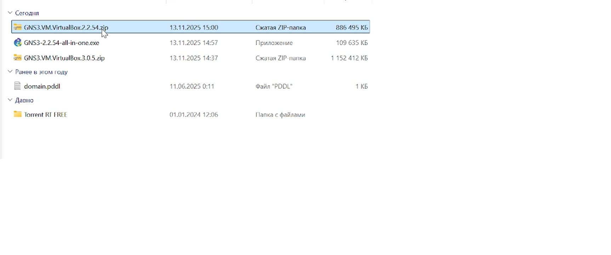
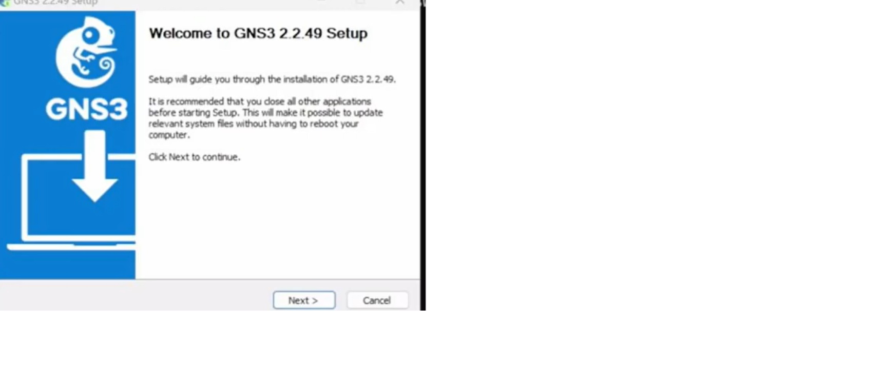
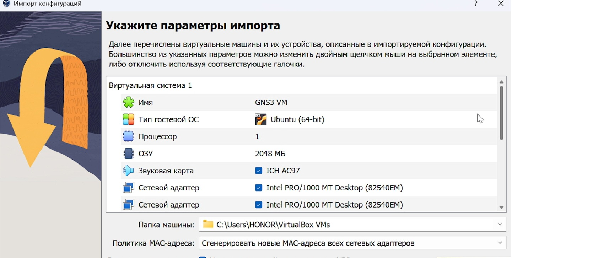
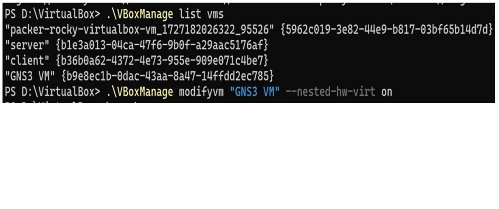
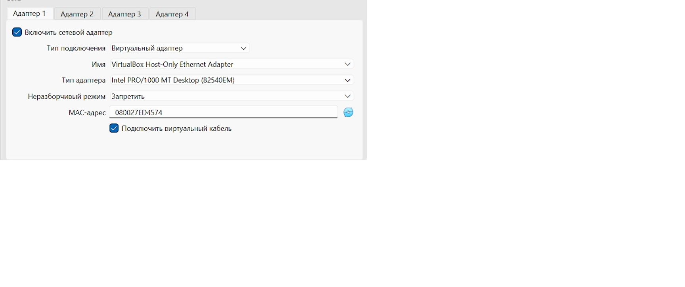
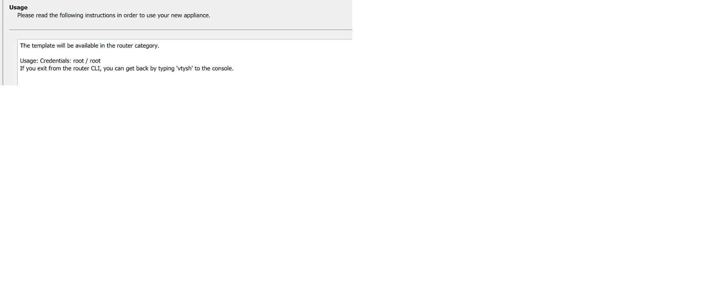
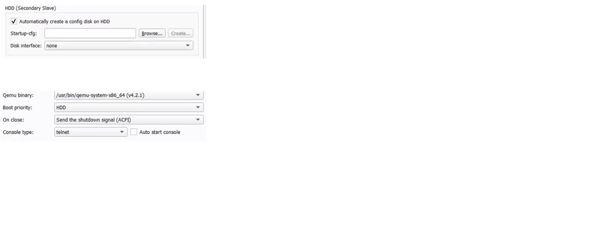
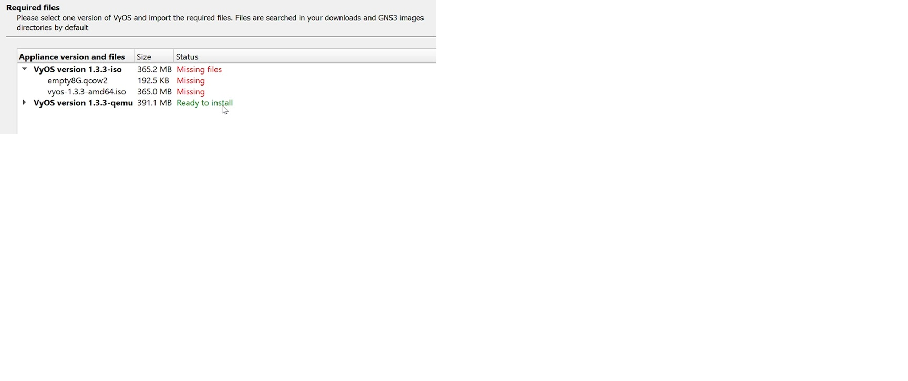

<!-- _class: lead -->
# Лабораторная работа №4
## Подготовка экспериментального стенда GNS3

**Выполнила:** Шихалиева Зурият Арсеновна  
**Группа:** [Нпибд03-23]
P
---

## Цели работы

- Установить GNS3-all-in-one и GNS3 VM
- Проверить корректность запуска
- Импортировать образ маршрутизатора FRR
- Импортировать образ маршрутизатора VyOS

---

## Загрузка GNS3

*Загрузка GNS3-all-in-one и GNS3 VM*

---

## Мастер установки

*Запуск установочного мастера GNS3*

---

## Выбор компонентов

*Выбор компонентов для установки*

---

## Выбор VirtualBox

*Выбор платформы виртуализации*

---

## Импорт виртуальной машины

*Импорт GNS3 VM в VirtualBox*

---

## Включение виртуализации

*Включение вложенной виртуализации*

---

## Настройка сети

*Настройка сетевого адаптера*

---

## Настройка DHCP

*Настройка DHCP-сервера*

---

## Запуск GNS3 VM

*Запуск виртуальной машины*

---

## Настройка сервера

*Настройка локального сервера GNS3*

---

## Создание шаблона

*Создание нового шаблона устройства*

---

## Выбор FRR

*Выбор образа маршрутизатора FRR*

---

## Версия FRR

*Выбор версии FRR 8.2.2*

---

## Завершение установки FRR

*Завершение установки FRR*

---

## Настройка FRR

*Настройка параметров FRR*

---

## Выбор VyOS

*Выбор образа VyOS*

---

## Результаты установки

*Успешно установлены FRR и VyOS*

---

## Выводы

- ✅ GNS3 успешно установлен и настроен
- ✅ Виртуальная машина запущена корректно
- ✅ Образы маршрутизаторов импортированы
- ✅ Стенд готов к работе

---

## Спасибо за внимание!