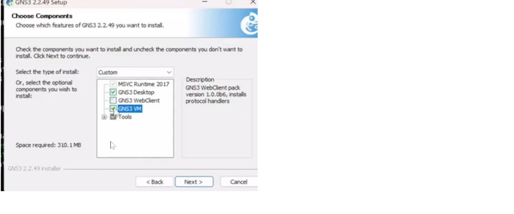
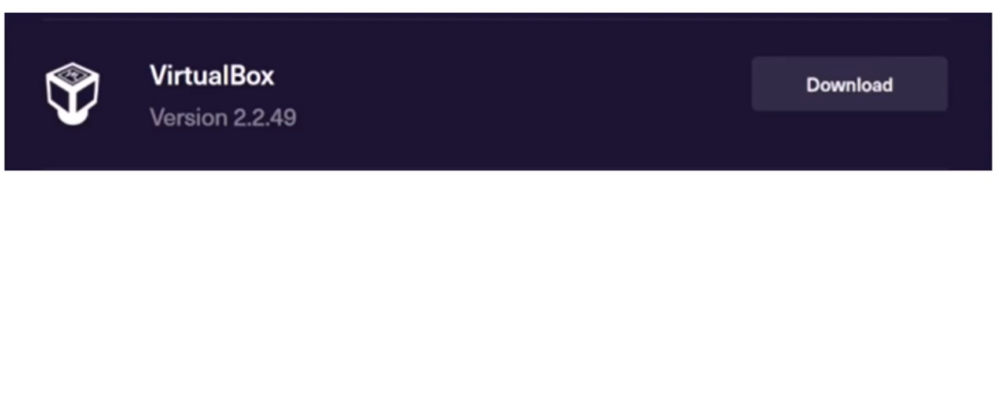
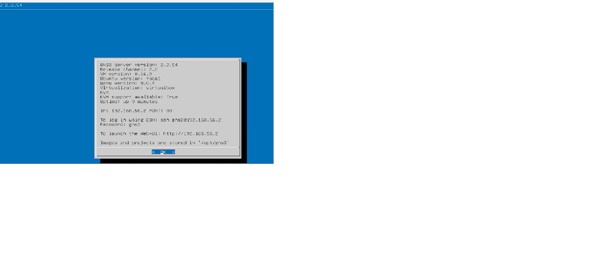
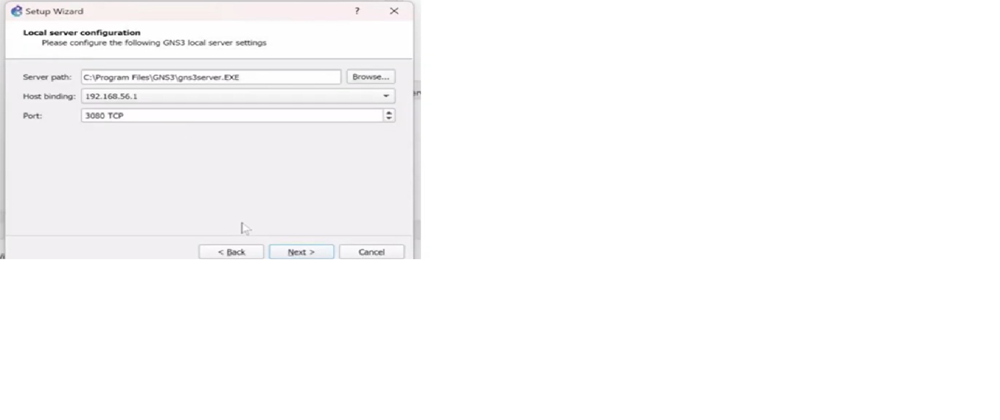
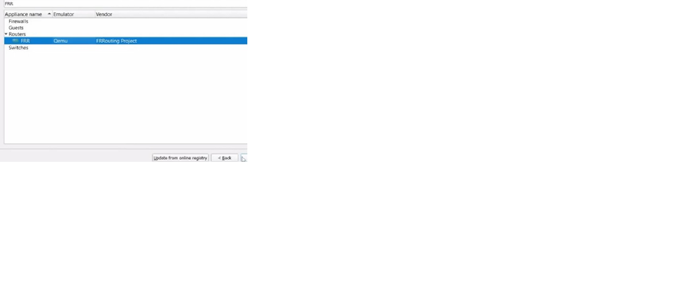
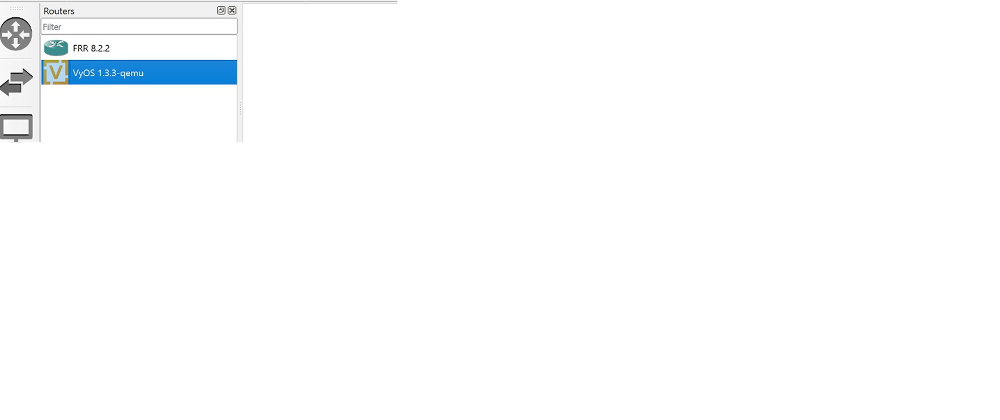

<!-- _class: lead -->
# **Подготовка экспериментального стенда GNS3**

 

**Выполнила:** Шихалиева Зурият Арсеновна  
**Группа:** Нпи6д03-23

---

## **Содержание**

1. Цели работы
2. Установка GNS3
3. Настройка виртуальной машины  
4. Импорт маршрутизаторов
5. Результаты
6. Выводы

---

## **Цели работы**

- Установить GNS3-all-in-one и GNS3 VM
- Проверить корректность запуска
- Импортировать образ маршрутизатора FRR  
- Импортировать образ маршрутизатора VyOS

---

## **Загрузка GNS3**

**Загрузка файлов GNS3-all-in-one и GNS3 VM**

---

## **Мастер установки**

**Запуск установочного мастера GNS3**

---

## **Выбор компонентов**

**Выбор компонентов для установки**

---

## **Выбор VirtualBox**

**Выбор платформы виртуализации**

---

## **Импорт виртуальной машины**

**Импорт GNS3 VM в VirtualBox**

---

## **Включение виртуализации**

**Включение вложенной виртуализации**

---

## **Настройка сети**

**Настройка сетевого адаптера**

---

## **Настройка DHCP**

**Настройка DHCP-сервера**

---

## **Запуск GNS3 VM**

**Запуск виртуальной машины**

---

## **Настройка сервера**

**Настройка локального сервера GNS3**

---

## **Создание шаблона**

**Создание нового шаблона устройства**

---

## **Выбор FRR**

**Выбор образа маршрутизатора FRR**

---

## **Версия FRR**

**Выбор версии FRR 8.2.2**

---

## **Завершение установки FRR**

**Завершение установки FRR**

---

## **Настройка FRR**

**Настройка параметров FRR**

---

## **Выбор VyOS**

**Выбор образа VyOS**

---

## **Результаты установки**

**Успешно установлены FRR и VyOS**

---

## **Выводы**

- ✅ **GNS3 успешно установлен и настроен**
- ✅ **Виртуальная машина запущена корректно**  
- ✅ **Образы маршрутизаторов импортированы**
- ✅ **Стенд готов к работе**

---

<!-- _class: lead -->
# **Спасибо за внимание!**

**Вопросы?**