. 15)---
## Front matter
title: "Отчет по лабораторной работе №3"
subtitle: "Операционные системы"
author: "Шихалиева Зурият Арсеновна"

## Generic otions
lang: ru-RU
toc-title: "Содержание"

## Bibliography
bibliography: bib/cite.bib
csl: pandoc/csl/gost-r-7-0-5-2008-numeric.csl

## Pdf output format
toc: true # Table of contents
toc-depth: 2
lof: true # List of figures
lot: true # List of tables
fontsize: 12pt
linestretch: 1.5
papersize: a4
documentclass: scrreprt
## I18n polyglossia
polyglossia-lang:
  name: russian
  options:
	- spelling=modern
	- babelshorthands=true
polyglossia-otherlangs:
  name: english
## I18n babel
babel-lang: russian
babel-otherlangs: english
## Fonts
mainfont: PT Serif
romanfont: PT Serif
sansfont: PT Sans
monofont: PT Mono
mainfontoptions: Ligatures=TeX
romanfontoptions: Ligatures=TeX
sansfontoptions: Ligatures=TeX,Scale=MatchLowercase
monofontoptions: Scale=MatchLowercase,Scale=0.9
## Biblatex
biblatex: true
biblio-style: "gost-numeric"
biblatexoptions:
  - parentracker=true
  - backend=biber
  - hyperref=auto
  - language=auto
  - autolang=other*
  - citestyle=gost-numeric
## Pandoc-crossref LaTeX customization
figureTitle: "Рис."
tableTitle: "Таблица"
listingTitle: "Листинг"
lofTitle: "Список иллюстраций"
lotTitle: "Список таблиц"
lolTitle: "Листинги"
## Misc options
indent: true
header-includes:
  - \usepackage{indentfirst}
  - \usepackage{float} # keep figures where there are in the text
  - \floatplacement{figure}{H} # keep figures where there are in the text
---
## Цель работы

Получение навыĸов правильной работы с репозиториями git.

## Задание

1. Установĸа git-flow
2. Установĸа Node.js
3. Настройĸа Node.js
4. Настройка git-flow
5. Создание релиза git-flow

## Выполнение лабораторной работы. Установка git-flow

Включаю corp репозитории (рис. 1) и устанавливаю git flow (рис. 2).

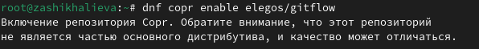{#fig:001 width=70%}

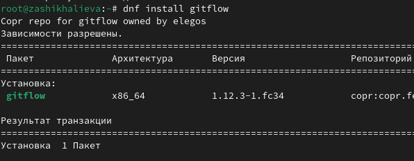{#fig:001 width=70%}

## Выполнение лабораторной работы. Установĸа Node.js 

Устанавливаю Node.js(рис. 3) и устаналиваю pnpm(рис. 4).

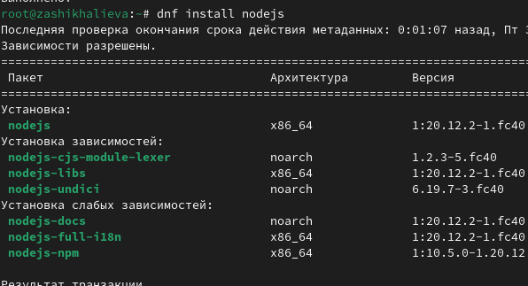{#fig:002 width=70%}

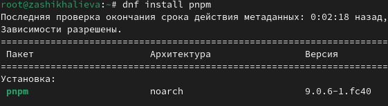{#fig:002 width=70%}

## Выполнение лабораторной работы. Настройка Node.js

Запусаю pnpm (рис. 5) и перелогиниваюсь (рис. 6).

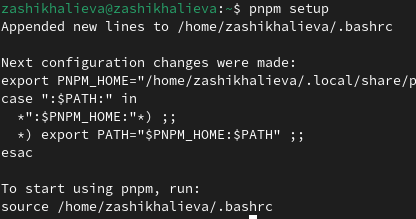{#fig:003 width=70%}

{#fig:002 width=70%}

## Выполнение лабораторной работы. Настройка Node.js

Устанавливаю программу для форматирования коммитов (рис. 7).

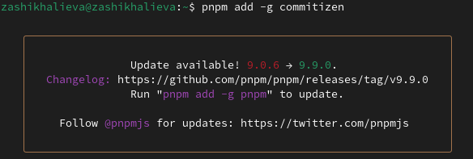{#fig:004 width=70%}

## Выполнение лабораторной работы. Настройка Node.js

Установливаю программу для создания логов (рис. 8)

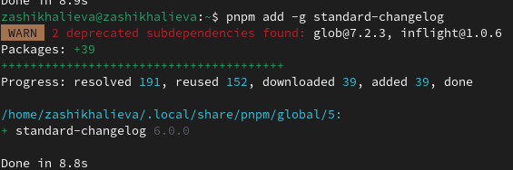{#fig:005 width=70%}

## Выполнение лабораторной работы. Настройка Node.js

- Создаю репозиторий на GitHub
- Создаю первый коммит и выкладываю на GitHub (рис.9).

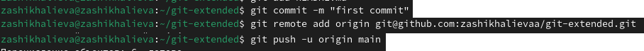{#fig:006 width=70%}

## Выполнение лабораторной работы. Настройка Node.js

Создаю конфигурационный файл и редактирую его через mc (рис.10). И далее добавляю новые файлы, выполняю коммит и отправляю на github.

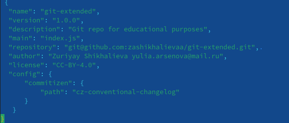{#fig:007 width=70%}

## Выполнение лабораторной работы. Настройка git-flow

Инициализирую git-flow (рис. 11) и убеждаюсь, что я на ветке develop и загружаю весь репозиторий в хранилище. 

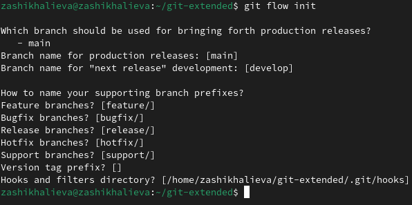{#fig:008 width=70%}

## Выполнение лабораторной работы. Настройка git-flow

- Устанавливаю вышестоящую ветку, как основную, для этой ветки
- Создаю релиз с версией 1.1 (рис. 12)
- Создаю журнал изменений (рис. 13).

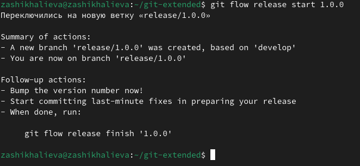{#fig:009 width=70%}

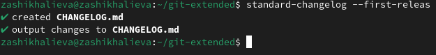{#fig:009 width=70%}

## Выполнение лабораторной работы. Настройка git-flow

- Добавляю журнал изменений в индекс
- Добавляю релизную ветку в основную (рис. 14)

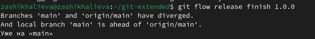{#fig:010 width=70%}

## Выполнение лабораторной работы. Настройка git-flow

- Отправляю данные на github
- Создаю релиз на github (рис. 15).

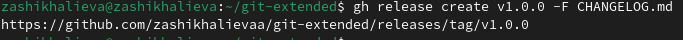{#fig:011 width=70%}

## Выполнение лабораторной работы. Настройка git-flow

- Создаю ветку новой функциональности
- Продолжаю работу с ней
- Объединяю ветки (рис. 16).

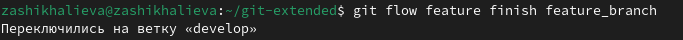{#fig:012 width=70%}

## Выполнение лабораторной работы. Создание релиза git-flow

- Создаю релиз с версией 1.2.3
- Редактирую файл package.json
- Создаю журнал изменений (рис. 17)
- Добавляю журнал изменений в индекс (рис. 18).

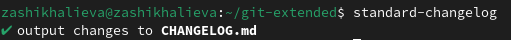{#fig:014 width=70%}

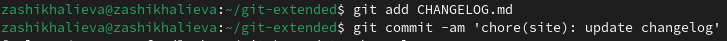{#fig:014 width=70%}

## Выполнение лабораторной работы. Создание релиза git-flow

- Заливаю релизную ветку, как основную
- Отправляю данные на github
- Создаю релиз с комментарией из журнала изменений (рис. 19).

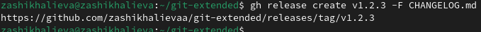{#fig:015 width=70%}

## Выводы

При выполнении лабораторной работы я получила навыки правильной работы с репозиториями git.

