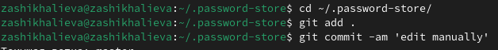

## Front matter
title: "Отчет по лабораторной работе №4"
subtitle: "Операционные системы"
author: "Шихалиева Зурият Арсеновна"

## Generic otions
lang: ru-RU
toc-title: "Содержание"

## Bibliography
bibliography: bib/cite.bib
csl: pandoc/csl/gost-r-7-0-5-2008-numeric.csl

## Pdf output format
toc: true # Table of contents
toc-depth: 2
lof: true # List of figures
lot: true # List of tables
fontsize: 12pt
linestretch: 1.5
papersize: a4
documentclass: scrreprt
## I18n polyglossia
polyglossia-lang:
  name: russian
  options:
	- spelling=modern
	- babelshorthands=true
polyglossia-otherlangs:
  name: english
## I18n babel
babel-lang: russian
babel-otherlangs: english
## Fonts
mainfont: PT Serif
romanfont: PT Serif
sansfont: PT Sans
monofont: PT Mono
mainfontoptions: Ligatures=TeX
romanfontoptions: Ligatures=TeX
sansfontoptions: Ligatures=TeX,Scale=MatchLowercase
monofontoptions: Scale=MatchLowercase,Scale=0.9
## Biblatex
biblatex: true
biblio-style: "gost-numeric"
biblatexoptions:
  - parentracker=true
  - backend=biber
  - hyperref=auto
  - language=auto
  - autolang=other*
  - citestyle=gost-numeric
## Pandoc-crossref LaTeX customization
figureTitle: "Рис."
tableTitle: "Таблица"
listingTitle: "Листинг"
lofTitle: "Список иллюстраций"
lotTitle: "Список таблиц"
lolTitle: "Листинги"
## Misc options
indent: true
header-includes:
  - \usepackage{indentfirst}
  - \usepackage{float} # keep figures where there are in the text
  - \floatplacement{figure}{H} # keep figures where there are in the text
---

## Задание

## Выполнение лабораторной работы. Менеджер паролей pass.

Устанавливаю программы pass и gopass (рис. 1). 

{#fig:001 width=70%}

## Выполнение лабораторной работы. Менеджер паролей pass. 

Просматриваю список ключей и инициилизирую хранилище (рис. 2).

{#fig:002 width=70%}

## Выполнение лабораторной работы. Менеджер паролей pass.

- Создаю структуру git
- Задаю адрес репозитория, предварительно создав его (рис. 3) и синхронизирую.

{#fig:003 width=70%}

## Выполнение лабораторной работы. Менеджер паролей pass. 

Создаю изменения непосредственно на файловой системе вручную (рис. 4) и проверяю статус синхронизации (рис. 5).

{#fig:004 width=70%}

{#fig:004 width=70%}

## Выполнение лабораторной работы. Менеджер паролей pass.

- Устанавливаю расширение browserpass (рис. 6).
- Устанавливаю интерфейс для взаимодействия с броузером (рис. 7).
- Устанавливаю интерфейс (рис. 8)
 
{#fig:005 width=70%}

{#fig:005 width=70%}

## Выполнение лабораторной работы. Менеджер паролей pass.

- Добавляю новый пароль (рис. 9) и заменяю его (рис. 10)

{#fig:006 width=70%}

{#fig:006 width=70%}

## Выполнение лабораторной работы. Управление файлами конфигурации.

Устанавливаю дополнительного программного обеспечения

{#fig:007 width=70%}

## Выполнение лабораторной работы. Управление файлами конфигурации.

Устанавливаю шрифты (рис.12), (рис. 13), (рис. 14).

{#fig:008 width=70%}

{#fig:008 width=70%}

{#fig:008 width=70%}

## Выполнение лабораторной работы. Управление файлами конфигурации.

Устанавливаю бинарный файл (рис. 15)

{#fig:009 width=70%}

## Выполнение лабораторной работы. Управление файлами конфигурации.

Создаю свой репозиторий для конфигурационного файла (рис. 16).

{#fig:010 width=70%}

## Выполнение лабораторной работы. Управление файлами конфигурации.

Подключаю репозиторий к своей системе (рис. 17)

{#fig:011 width=70%}

## Выполнение лабораторной работы. Управление файлами конфигурации.

- На второй машине инициализирую chezmoi (рис. 18).
- Принимаем изменения
- Вызываю инструмент слияния веток (рис. 19).
- Получаю и применяю изменения из репозитория (рис. 20).
{#fig:012 width=70%}

{#fig:012 width=70%}

{#fig:012 width=70%}

## Выполнение лабораторной работы. Создание релиза git-flow

Устанавливаю dotfiles с помощью одной команды 

{#fig:014 width=70%}

## Выполнение лабораторной работы. Создание релиза git-flow

Чтобы фиксировать автоматически добавляю в файл конфигурации параметры (рис. 22).

{#fig:015 width=70%}

