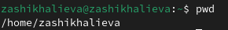
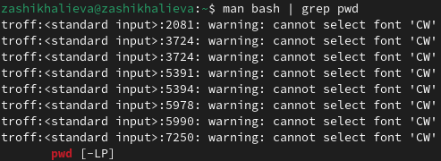

pwd
## Front matter
title: "Отчет по лабораторной работе №6"
subtitle: "Операционные системы"
author: "Шихалиева Зурият Арсеновна"

## Generic otions
lang: ru-RU
toc-title: "Содержание"

## Bibliography
bibliography: bib/cite.bib
csl: pandoc/csl/gost-r-7-0-5-2008-numeric.csl

## Pdf output format
toc: true # Table of contents
toc-depth: 2
lof: true # List of figures
lot: true # List of tables
fontsize: 12pt
linestretch: 1.5
papersize: a4
documentclass: scrreprt
## I18n polyglossia
polyglossia-lang:
  name: russian
  options:
	- spelling=modern
	- babelshorthands=true
polyglossia-otherlangs:
  name: english
## I18n babel
babel-lang: russian
babel-otherlangs: english
## Fonts
mainfont: PT Serif
romanfont: PT Serif
sansfont: PT Sans
monofont: PT Mono
mainfontoptions: Ligatures=TeX
romanfontoptions: Ligatures=TeX
sansfontoptions: Ligatures=TeX,Scale=MatchLowercase
monofontoptions: Scale=MatchLowercase,Scale=0.9
## Biblatex
biblatex: true
biblio-style: "gost-numeric"
biblatexoptions:
  - parentracker=true
  - backend=biber
  - hyperref=auto
  - language=auto
  - autolang=other*
  - citestyle=gost-numeric
## Pandoc-crossref LaTeX customization
figureTitle: "Рис."
tableTitle: "Таблица"
listingTitle: "Листинг"
lofTitle: "Список иллюстраций"
lotTitle: "Список таблиц"
lolTitle: "Листинги"
## Misc options
indent: true
header-includes:
  - \usepackage{indentfirst}
  - \usepackage{float} # keep figures where there are in the text
  - \floatplacement{figure}{H} # keep figures where there are in the text
---
## Цель работы

Приобретение практических навыков взаимодействия пользователя с системой посредством командной строки.

## Задание

1. Определите полное имя вашего домашнего каталога. Далее относительно этого каталога будут выполняться последующие упражнения.
2. Выполните следующие действия:
- 2.1. Перейдите в каталог /tmp.
- 2.2. Выведите на экран содержимое каталога /tmp. Для этого используйте команду ls с различными опциями. Поясните разницу в выводимой на экран информации.
- 2.3. Определите, есть ли в каталоге /var/spool подкаталог с именем cron?
- 2.4. Перейдите в Ваш домашний каталог и выведите на экран его содержимое. Определите, кто является владельцем файлов и подкаталогов?
3. Выполните следующие действия:
- 3.1. В домашнем каталоге создайте новый каталог с именем newdir.
- 3.2. В каталоге ~/newdir создайте новый каталог с именем morefun.
- 3.3. В домашнем каталоге создайте одной командой три новых каталога с именами letters, memos, misk. Затем удалите эти каталоги одной командой.
- 3.4. Попробуйте удалить ранее созданный каталог ~/newdir командой rm. Проверьте, был ли каталог удалён.
- 3.5. Удалите каталог ~/newdir/morefun из домашнего каталога. Проверьте, был ли каталог удалён.
4. С помощью команды man определите, какую опцию команды ls нужно использо-
вать для просмотра содержимое не только указанного каталога, но и подкаталогов,
входящих в него.
5. С помощью команды man определите набор опций команды ls, позволяющий отсортировать по времени последнего изменения выводимый список содержимого каталога
с развёрнутым описанием файлов.
6. Используйте команду man для просмотра описания следующих команд: cd, pwd, mkdir,
rmdir, rm. Поясните основные опции этих команд.
7. Используя информацию, полученную при помощи команды history, выполните модификацию и исполнение нескольких команд из буфера команд.

## Выполнение лабораторной работы.

Определяю полное имя своего домашнего каталога с помощью команды pwd (рис. 1).

{#fig:001 width=70%, рис. 1}

С помощью команды cd перехожу в каталог /tmp (рис. 2).

{#fig:001 width=70%, рис. 2}

Вывожу содержимое каталога /tmp с помощью команды ls (рис. 3).

{#fig:001 width=70%, рис. 3}

Далее, использую команду ls с параметром -l и вижу, что информация показывается в виде списка с подробной информацией (рис. 4).

{#fig:001 width=70%, рис. 4}

Использую команду ls с параметром -a и вижу, что показываются скрытые файлы (рис. 5).

{#fig:001 width=70%, рис. 5}

Определяю, есть ли в каталоге /var/spool подкаталог с именем cron с помощью команды ls /var/spool (рис. 6). И вижу, что такого каталога нет.

{#fig:001 width=70%, рис. 6}

Определяю владельца каталогов в домашнем каталоге с помощью команды ls ~/ -l (рис. 7). И вижу, что владельцем каталогов явялется пользователь zakhalieva.

{#fig:001 width=70%, рис. 7}

Перехожу в домашний каталог и создаю каталог newdir с помощью команды mkdir. (рис. 8).

{#fig:001 width=70%, рис. 8}

Создаю подкаталог в каталоге newdir с именем morefun (рис. 9).

{#fig:001 width=70%, рис. 9}

Создаю каталоги letters, memos, misk одной командой, и удаляю также одной командой (рис.10).

{#fig:001 width=70%, рис. 10}

Командой rm нельзя удалить каталог, в чем я убеждаюсь. Чтобы удалить каталог, нужно добавить параметр -r.

{#fig:001 width=70%, рис. 11}

Удаляю каталог ~/newdir/morefun с помощью команды rmdir и параметра -p (рис. 12).

{#fig:001 width=70%, рис. 12}

С помощью команды man ls я могу прочесть документацию к команде ls, параметр, который позолить выводить все подкаталоги каталогов предоставлена на скриншоте, это -R. (рис. 13). 

{#fig:001 width=70%, рис. 13}

С помощью man ls открываю документацию и нахожу информацию о параметре для сортировки (рис. 14).

{#fig:001 width=70%, рис. 14}

С помощью man cd узнаю описание команды cd и ее опции. Основных опций немного (рис. 15).
1. -P - позволяет следовать по символическим ссылкам перед тем, как обработаны все переходы '..'
3. -L - переходит по символическим ссылкам только после того, как обработаны все переходы ".."
4. -e - позволяет выйти с ошибкой, если диреткория, в которую нужно перейти, не найдена.

{#fig:001 width=70%, рис. 15}

С помощью man pwd узнаю описание команды pwd и ее опции (рис. 16).
1. -L - брать директорию из переменной окружения, даже если она содержит символические ссылки.
2. -P - отбрасывать все символические ссылки.

{#fig:001 width=70%, рис. 16}

С помощью man mkdir узнаю описание команды mkdir и ее опции (рис. 17).
1. -m - устанавливает права доступа создаваемой директории как chmod, синтаксис тоже как у chmod.
2. -p - позволяет рекурсивно создавать директории и их подкаталоги
3. -v - выводи сообщение о созданных директориях
4. -z - установить контекст SELinux для создаваемой директории по умолчанию
5. -context - установить контекст SELinux для создаваемой директории в значении CTX

{#fig:018 width=70%, рис. 17}

С помощью man rmdir узнаю описание команды rmdir и ее опции (рис. 18).
1. --ignore-fail-on-non-empty - отменяет вывод ошибки, если каталог не пустой, просто его игнорирует
2. -p - удаляет рекурсивно каталоги, если они все содержат в себе только удаляемый каталог
3. -v - выводит сообщение о каждом удалении  директории.

{#fig:019 width=70%, рис. 18}

С помощью man rm узнаю описание команды rm и ее опции (рис. 19).
1. -f - игнорировать несуществующие файлы или аргументы, никогда не выводить запрос на подтверждение удаления
2. -i - выводить запрос на подтверждение удаления каждого файла
3. -I - вывести запрос на подтверждение удаления один раз, для всех файлов, если удаляется больше 3-х файлов или идет рекурсивное удаление
4. --interactive - заменяет предыдущие три опции, можно выбрать одну из них.
5. --one-file-system - во время рекурсивного удаления пропускать директории из других файловых систем
6. --no-preserve-root если в качестве директории задана корневая, то считать что это обычная директория и начать удаление.
7. -r, -R - удаляет директории их содержимое рекурсивно
8. -d, --dir - удаляет пустые директории
9. -v - прописывает все действия команды
10. Опции --help --version применимы почти ко всем утилитам, они показывают справку по команде и ее версию соответственно.
{#fig:020 width=70%, рис. 19}

Вывела историю команд с помощью утилиты history (рис. 20).

{#fig:021 width=70%, рис. 20}

Выполнила команду из буфера команд (рис. 21).

{#fig:022 width=70%, рис. 21}

Модифицировала команду (рис. 22).

{#fig:023 width=70%, рис. 22}

## Выводы

Я приобрела практические навыки взаимодействия пользователя с системой посредством командной строки.

# Ответы на контрольные вопросы

1. Командная строка - это текстовая система, которая передает команды компьютеру и возвращает результаты пользователю. В операционной системе типа Linux взаимодействие пользователя с системой обычно
осуществляется с помощью командной строки посредством построчного ввода команд.
2. Для определения абсолютного пути к текущему каталогу используется команда pwd. Например: если я введу
pwd в своем домашнем каталоге то получу /home/evdvorkina
3. С помощью команды ls можно определить имена файлов, при помощи опции -F уже мы сможем определить тип файлов, если нам необходимы скрытые файлы, добавим опцию -a. Пример есть в лабораторной работе.
4. С помощью команды ls можно определить имена файлов, если нам необходимы скрытые файлы, добавим опцию -a. Пример есть в лабораторной работе.
5. rmdir по умолчанию удаляет пустые каталоги, не удаляет файлы. rm удаляет файлы, без дополнительных опций (-d, -r) не будет удалять каталоги. Удалить в одной строчке одной командой можно файл и каталог. Если файл находится в каталоге, используем рекурсивное удаление, если файл и каталог не связаны подобным образом, то добавим опцию -d, введя имена через пробел после утилиты.
6. Вывести информацию о последних выполненных пользователем команд можно с помощью history. Пример приведет в лабораторной работе.
7. Используем синтаксиси !номеркоманды в выводе history:s/ что заменяем на примере приведенные в лабораторной работе.
8. Предположим, я нахожусь не в домашнем каталоге. Если я введу "cd ~/ ; ls", то окажусь в домашнем каталоге и получу вывод файлов внутри него.
9. Символ экранирования - (обратный слеш) добавление перед спецсимволом обратный слеш, чтобы использовать специальный символ как обычный. Также позволяет читать системе название директорий с пробелом. Пример: cd work/Операционные\ системы/
10. Опция -l позволит увидеть дополнительную информацию о файлах в каталоге: время создания, владельца, права доступа
11. Относительный путь к файлу начинается из той директории, где вы находитесь (она сама не прописывается в пути), он прописывается относительно данной директории. Абсолютный путь начинается с корневого каталога.
12. Использовать man <имя команды> или <имя команды> --help
13. Клавиша Tab.

