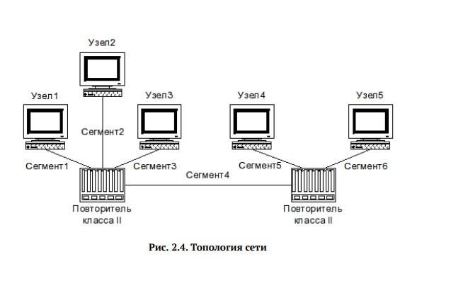
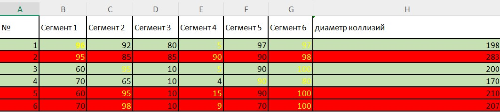
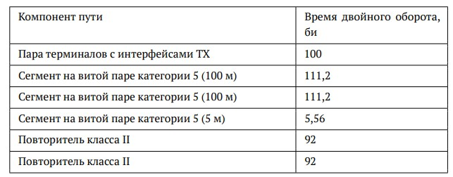
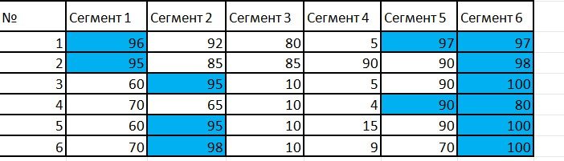
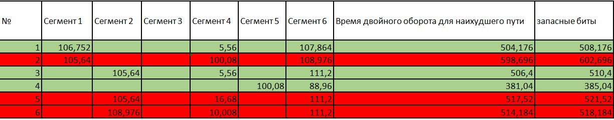

---
## Front matter
title: "Отчет по лабораторной работе №2"
subtitle: "Расчёт сети Fast Ethernet"
author: "Иванов Иван Иванович"

## Generic options
lang: ru-RU
toc-title: "Содержание"

## Pdf output format
toc: true
toc-depth: 2
lof: true
lot: true
fontsize: 12pt
linestretch: 1.5
papersize: a4
documentclass: scrreprt
---

МИНИСТЕРСТВО ОБРАЗОВАНИЯ И НАУКИ РОССИЙСКОЙ ФЕДЕРАЦИИ

ФЕДЕРАЛЬНОЕ ГОСУДАРСТВЕННОЕ АВТОНОМНОЕ ОБРАЗОВАТЕЛЬНОЕ УЧРЕЖДЕНИЕ

ВЫСШЕГО ОБРАЗОВАНИЯ

«РОССИЙСКИЙ УНИВЕРСИТЕТ ДРУЖБЫ НАРОДОВ»

ФАКУЛЬТЕТ ФИЗИКО-МАТЕМАТИЧЕСКИХ И ЕСТЕСТВЕННЫХ НАУК

КАФЕДРА ПРИКЛАДНОЙ ИНФОРМАТИКИ И ТЕОРИИ ВЕРОЯТНОСТЕЙ

**ОТЧЕТ ПО ЛАБОРАТОРНОЙ РАБОТЕ №2**

**Расчёт сети Fast Ethernet**

**Выполнил:** Шихалиева Зурият Арсеновна
**Группа:** НПИбд-02-23

**Преподаватель:** Кулябов Д.С.

Москва

2026

## Цель работы

Целью данной лабораторной работы являлось изучение принципов технологии Ethernet и Fast Ethernet, и практическое освоение методики оценки работоспособности сети, построенной на базе технологии Fast Ethernet.

## Задание

Первым заданием было оценить работоспособность 100-мегабитной сети Fast Ethernet в соответствии с первой моделью, и вторым заданием — в соответствии со второй моделью. Представлена топология сети, которую мы оценивали, и конфигурации.

Рис. 1. Топология сети

## Выполнение лабораторной работы

### Оценка по первой модели

Для начала необходимо было посчитать диаметр домена коллизий и сравнить его с предельно допустимым значением для нашей конфигурации сети. Наша сеть состоит из терминалов с интерфейсами TX, а также из двух повторителей второго класса. Это видно на топологии (рис. 1). Следовательно, предельно допустимый диаметр домена коллизий равен 205 м.

Мы выбираем максимальные значения разделённых повторителями сегментов и суммируем их. В таблице 2 приведены необходимые расчёты. Жёлтым цветом выделены значения, сумму которых я искала. Красным отмечены неработоспособные конфигурации сети, а зелёным — работоспособные. Красные варианты имеют значение диаметра домена коллизий, превысившее 205 м, поэтому они оказались неработоспособными.

Таблица 2. Расчёт диаметра домена коллизий по первой модели

### Оценка по второй модели

Второе задание: нужно было оценить работоспособность сети по всем вариантам в соответствии со второй моделью. Для этого я вычисляла время двойного оборота (PDV). В методических указаниях была приведена таблица со временем двойного оборота для каждого компонента пути. Я её перенесла для удобства расчёта в свою таблицу.

Таблица 3. Временные задержки компонентов сети Fast Ethernet

Далее, в эту таблицу я перенесла длины всех имеющихся компонентов сети, всех сегментов. Фиолетовым цветом отмечены те, которые я суммировала для поиска наихудшего пути. Так как для расчёта PDV нам нужно было найти наихудший путь между двумя узлами домена коллизий.

Таблица 4. Расчёт времени двойного оборота для всех вариантов

В итоговой таблице приведены расчёты удельного времени двойного оборота для нужных нам сегментов. Также в ней представлена колонка времени двойного оборота для наихудшего пути — это сумма временных задержек в сегментах, повторителях и терминалах. И колонка с учётом четырёх запасных бит на случай непредвиденных задержек.

**[МЕСТО ДЛЯ ТАБЛИЦЫ 4: Расчёт PDV для всех вариантов]**

Таблица 4. Расчёт времени двойного оборота для всех вариантов

Например, для первого варианта время двойного оборота для наихудшего пути равно:
- Сегмент 1: 96 м × 1,112 = 106,752 би
- Сегмент 4: 5 м × 1,112 = 5,56 би
- Сегмент 6: 97 м × 1,112 = 107,864 би
- Пара терминалов TX/FX: 100 би
- Повторитель класса II №1: 92 би
- Повторитель класса II №2: 92 би
- **Итого PDV = 106,752 + 5,56 + 107,864 + 100 + 92 + 92 = 504,176 би**
- **С учётом 4 бит запаса: 504,176 + 4 = 508,176 би** ≤ 512 би → сеть работоспособна

## Вывод

В процессе выполнения данной лабораторной работы я изучила принципы технологии Ethernet и Fast Ethernet, а также освоила методики оценки работоспособности сети, построенной на базе технологии Fast Ethernet.

Спасибо за внимание. До свидания.