# Лабораторная работа №3  
**Анализ трафика в Wireshark**  
**ФИО студента:** [Шихалиева Зурият Арсеновна]  
**Группа:** [Нпибд-03-23]

---

## Цель работы  
Изучение посредством Wireshark кадров Ethernet, анализ PDU протоколов транспортного и прикладного уровней стека TCP/IP.

---

## Задание 3.3.1: MAC-адресация

### 3.3.1.1 Постановка задачи  
1. Изучение возможностей команды `ipconfig` (Windows) или `ifconfig` (Linux).  
2. Определение MAC-адреса устройства и его типа.

### 3.3.1.2 Результаты выполнения

#### 1. Вывод информации о сетевом соединении  
**Команда:** `ipconfig` и `ipconfig /all`

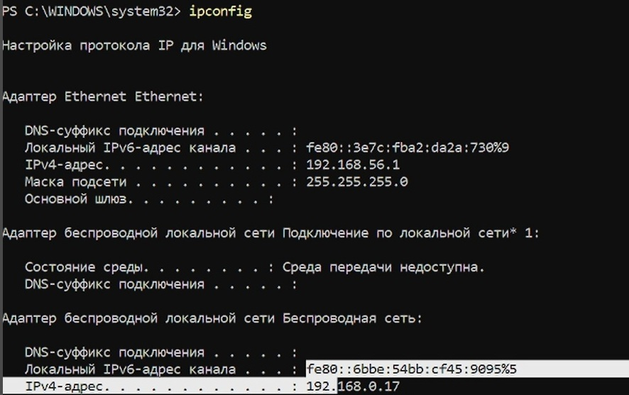

**Пояснение:**  
В выводе представлена информация о сетевых интерфейсах, включая:  
- IPv4 адрес: 192.168.0.17  
- IPv6 адрес: fe80::6bbe:54bb:cf45:9095%5  
- Маска подсети: 255.255.255.0

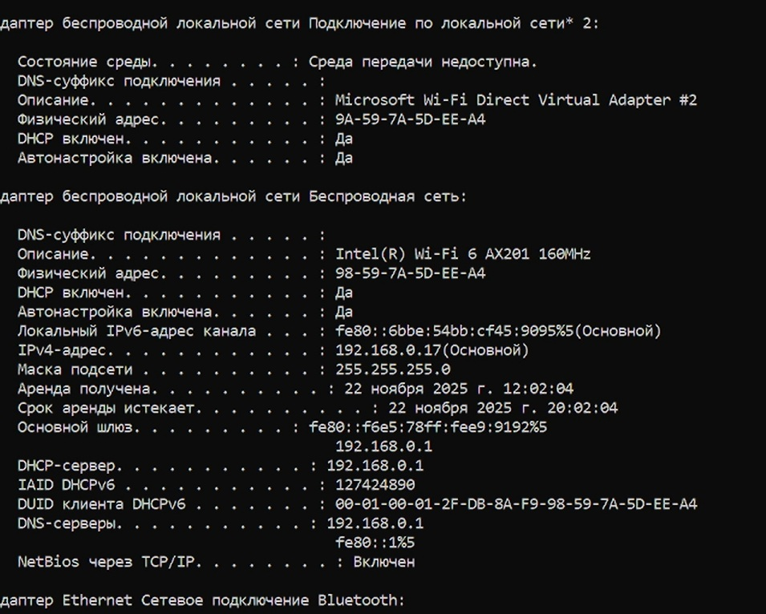

**Пояснение:**  
В детальном выводе представлена дополнительная информация:  
- Физический адрес (MAC): 98-59-7A-5D-EE-A4  
- Основной шлюз: 192.168.0.1  
- DHCP сервер: 192.168.0.1  
- DNS серверы: 192.168.0.1

#### 2. Определение MAC-адресов сетевых интерфейсов  
**Основной MAC-адрес беспроводного адаптера:** 98-59-7A-5D-EE-A4

#### 3. Структура MAC-адреса  
**MAC-адрес:** `98-59-7A-5D-EE-A4`  

- **Первые 3 байта** (`98-59-7A`) — идентификатор производителя (OUI). Производитель: Intel Corporation  
- **Последние 3 байта** (`5D-EE-A4`) — уникальный идентификатор сетевого интерфейса.  
- **Тип адреса:**  
  - **Индивидуальный** (unicast), так как младший бит первого байта = 0  
  - **Глобально администрируемый** (universal), так как предпоследний бит первого байта = 0

---

## Задание 3.3.2: Анализ кадров канального уровня в Wireshark

### 3.3.2.1 Постановка задачи  
1. Установить Wireshark.  
2. Захватить и проанализировать пакеты ARP и ICMP.

### 3.3.2.2 Результаты выполнения

#### 1. Установка и запуск Wireshark  
*Wireshark успешно установлен и запущен*

#### 2. Определение IP-адреса и шлюза  
**IP-адрес устройства:** 192.168.0.17  
**Шлюз по умолчанию:** 192.168.0.1

#### 3. Ping шлюза по умолчанию  
**Команда:** `ping 192.168.0.1`

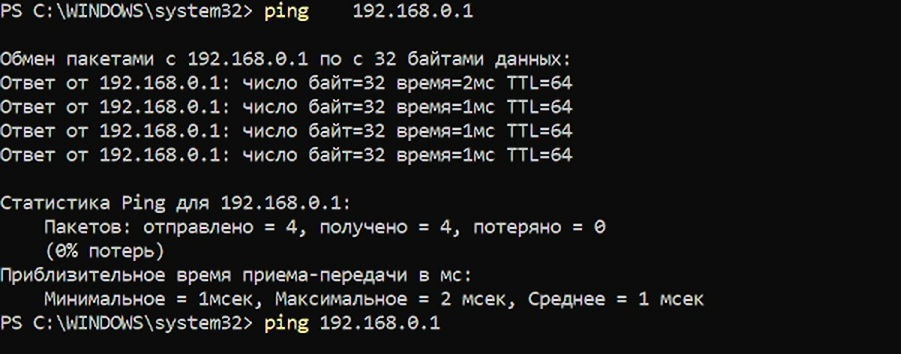

**Результат:**  
- Отправлено: 4 пакета  
- Получено: 4 пакета  
- Потерь: 0%  
- Время приема-передачи: 1-2 мс

#### 4. Захват и фильтрация трафика  
**Фильтр:** `arp or icmp`

#### 5. Анализ ICMP-пакетов  
**Эхо-запрос (Request):**  
- Длина кадра: 74 байта  
- Тип Ethernet: Ethernet II  
- MAC источника: 98:59:7a:5d:ee:a4  
- MAC получателя: f4:e5:78:e9:91:92  
- Тип адресов: индивидуальные (unicast)  

**Эхо-ответ (Reply):**  
- Длина кадра: 74 байта  
- Тип Ethernet: Ethernet II  
- MAC источника: f4:e5:78:e9:91:92  
- MAC получателя: 98:59:7a:5d:ee:a4  
- Тип адресов: индивидуальные (unicast)  

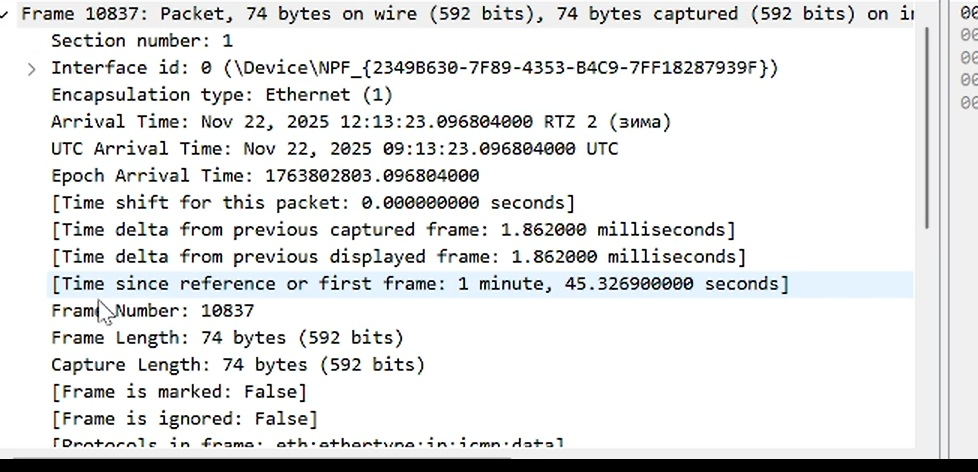

#### 6. Анализ ARP-пакетов  
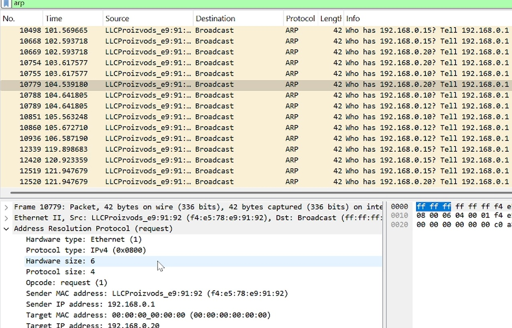

**Поля заголовка Ethernet II:**  
- MAC назначения: ff:ff:ff:ff:ff:ff (broadcast)  
- MAC источника: f4:e5:78:e9:91:92  
- Тип: 0x0806 (ARP)

**Поля ARP запроса:**  
- Hardware type: Ethernet (1)  
- Protocol type: IPv4 (0x0800)  
- Opcode: request (1)  
- Sender MAC: f4:e5:78:e9:91:92  
- Sender IP: 192.168.0.1  
- Target MAC: 00:00:00:00:00:00  
- Target IP: 192.168.0.20

#### 7. Ping по имени (www.yandex.ru)  
**Команда:** `ping www.yandex.ru`

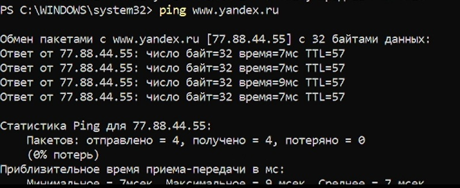

**Результат:**  
- IP адрес: 77.88.44.55  
- Время приема-передачи: 7-9 мс  
- TTL: 57

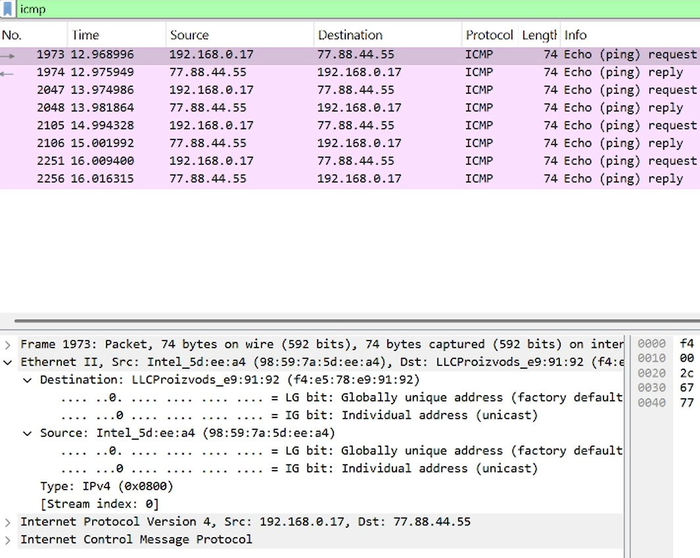

**Наблюдения:**  
- DNS запрос для разрешения имени www.yandex.ru  
- ICMP запросы и ответы между 192.168.0.17 и 77.88.44.55  
- MAC адрес источника: 98:59:7a:5d:ee:a4  
- MAC адрес получателя: f4:e5:78:e9:91:92 (шлюз)

---

## Задание 3.3.3: Анализ протоколов транспортного уровня

### 3.3.3.1 Постановка задачи  
Захватить и проанализировать пакеты HTTP, DNS, QUIC.

### 3.3.3.2 Результаты выполнения

#### 1. Захват HTTP-трафика  
**Фильтр:** `http`

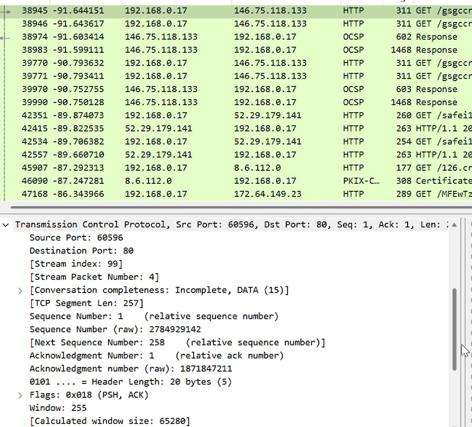

**Пояснение:**  
- Видны GET запросы к различным серверам  
- Заголовки TCP: порты (60596 → 80), номера последовательностей, флаги  
- Флаг PSH (Push) указывает на необходимость немедленной передачи данных приложению  
- Флаг ACK подтверждает получение данных

#### 2. Захват DNS-трафика  
*DNS трафик был захвачен при ping по имени, но отдельный скриншот не предоставлен*

**Пояснение:**  
- Запросы и ответы по UDP на порт 53  
- Разрешение имен в IP адреса  
- Типы записей (A, AAAA, CNAME)

#### 3. Захват QUIC-трафика  
**Фильтр:** `quic`

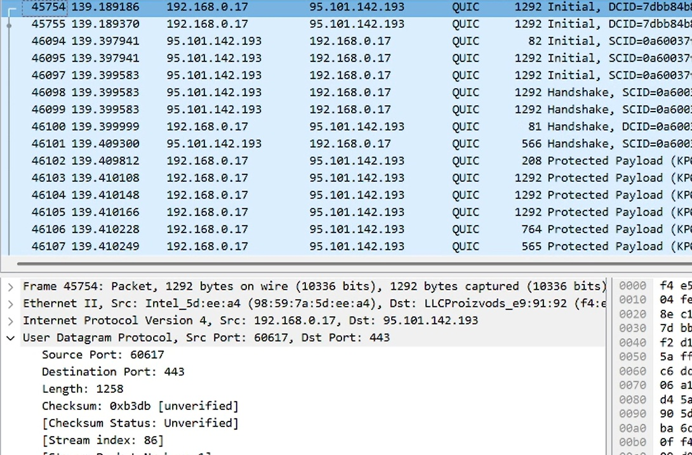

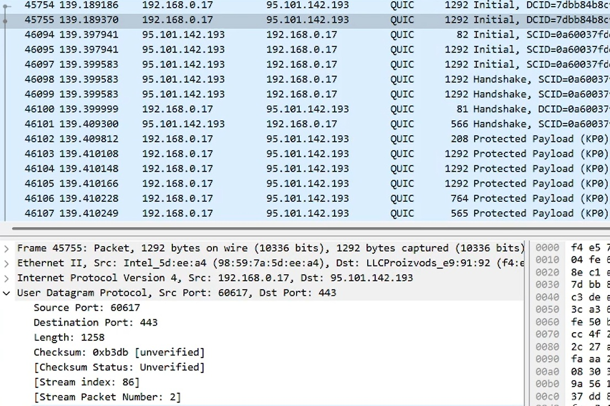

**Пояснение:**  
- Пакеты передаются поверх UDP (порты 60617 → 443)  
- Видны этапы установления соединения: Initial, Handshake  
- Зашифрованные данные в Protected Payload  
- Используются Connection ID (DCID, SCID) для идентификации соединений  
- Длина пакетов: 1292 байта (максимальный размер для эффективной передачи)

---

## Задание 3.3.4: Анализ handshake протокола TCP

### 3.3.4.1 Постановка задачи  
Проанализировать процесс установления TCP-соединения (three-way handshake).

### 3.3.4.2 Результаты выполнения

#### 1. Захват TCP-соединения  
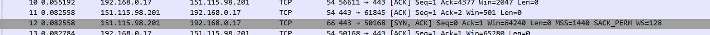

#### 2. Анализ трёхэтапного handshake  
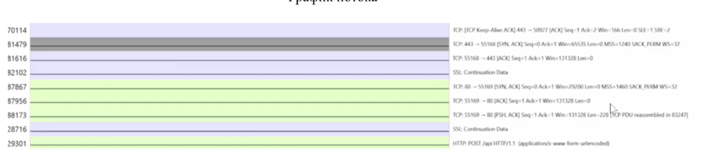

**Three-way handshake:**

1. **SYN** от клиента:  
   - Флаг SYN = 1  
   - Sequence Number = 0  
   - Window Size = 65535

2. **SYN-ACK** от сервера:  
   - Флаги SYN = 1, ACK = 1  
   - Sequence Number = 0  
   - Acknowledgment Number = 1  
   - Window Size = 65535

3. **ACK** от клиента:  
   - Флаг ACK = 1  
   - Sequence Number = 1  
   - Acknowledgment Number = 1  
   - Window Size = 131328

#### 3. График потока TCP  
*График потока не представлен на скриншотах*

**Пояснение:**  
График показывает последовательность пакетов, их размер и направление, визуализируя процесс handshake и последующей передачи данных.

---

## Выводы  
1. Освоены основы работы с Wireshark для анализа сетевого трафика на разных уровнях OSI
2. Изучена структура MAC-адресов: определен производитель (Intel) по OUI, установлен тип адреса (unicast, universal)
3. Проанализированы протоколы:
   - **Канальный уровень**: Ethernet фреймы, ARP запросы
   - **Сетевой уровень**: ICMP запросы/ответы, IP адресация
   - **Транспортный уровень**: TCP handshake, UDP для DNS, QUIC поверх UDP
4. Исследован процесс установления TCP-соединения (three-way handshake) с анализом флагов и номеров последовательностей
5. Получены навыки применения фильтров для анализа конкретных протоколов (arp, icmp, http, dns, quic)
6. На практике изучены особенности протокола QUIC: мультиплексирование, шифрование, работа поверх UDP

---

## Ответы на контрольные вопросы  
*(Здесь вы можете добавить ответы на вопросы, если они были предоставлены)*