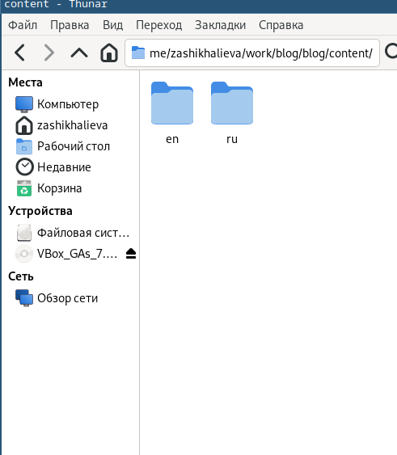
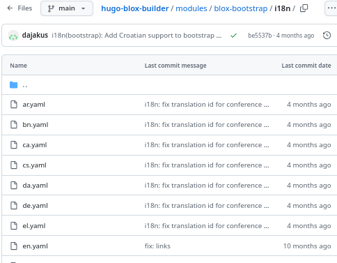
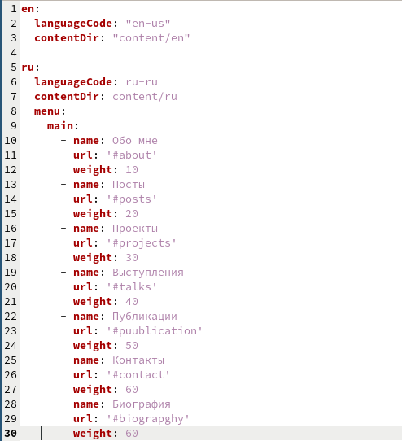
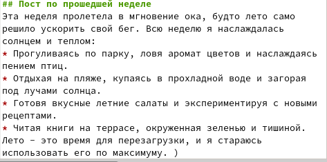
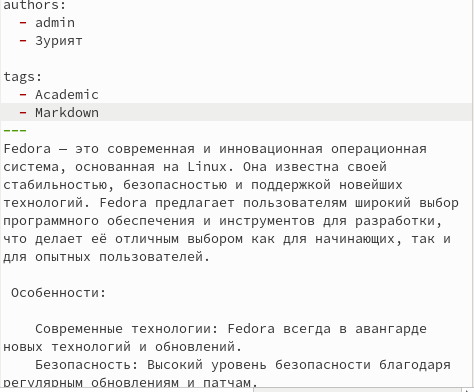
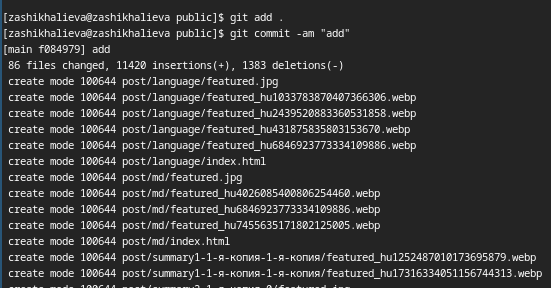
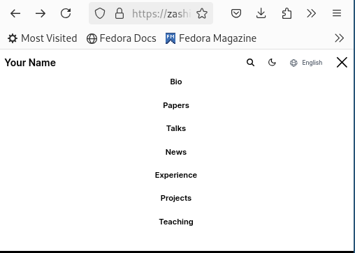

---
## Front matter
title: "Отчет по индивидуальному проекту №6"
subtitle: "Операционные системы"
author: "Шихалиева Зурият Арсеновна"

## Generic otions
lang: ru-RU
toc-title: "Содержание"

## Bibliography
bibliography: bib/cite.bib
csl: pandoc/csl/gost-r-7-0-5-2008-numeric.csl

## Pdf output format
toc: true # Table of contents
toc-depth: 2
lof: true # List of figures
lot: true # List of tables
fontsize: 12pt
linestretch: 1.5
papersize: a4
documentclass: scrreprt
## I18n polyglossia
polyglossia-lang:
  name: russian
  options:
	- spelling=modern
	- babelshorthands=true
polyglossia-otherlangs:
  name: english
## I18n babel
babel-lang: russian
babel-otherlangs: english
## Fonts
mainfont: PT Serif
romanfont: PT Serif
sansfont: PT Sans
monofont: PT Mono
mainfontoptions: Ligatures=TeX
romanfontoptions: Ligatures=TeX
sansfontoptions: Ligatures=TeX,Scale=MatchLowercase
monofontoptions: Scale=MatchLowercase,Scale=0.9
## Biblatex
biblatex: true
biblio-style: "gost-numeric"
biblatexoptions:
  - parentracker=true
  - backend=biber
  - hyperref=auto
  - language=auto
  - autolang=other*
  - citestyle=gost-numeric
## Pandoc-crossref LaTeX customization
figureTitle: "Рис."
tableTitle: "Таблица"
listingTitle: "Листинг"
lofTitle: "Список иллюстраций"
lotTitle: "Список таблиц"
lolTitle: "Листинги"
## Misc options
indent: true
header-includes:
  - \usepackage{indentfirst}
  - \usepackage{float} # keep figures where there are in the text
  - \floatplacement{figure}{H} # keep figures where there are in the text
---

# Цель работы

Продолжить работы со своим сайтом. Редактировать его в соответствии с требованиями. Добавить данные о своих социальных сетях.

# Задание

Сделать локализацию сайта.
Сделать пост по прошедшей неделе.
Добавить пост на тему по выбору.
        

# Выполнение лабораторной работы

Перехожу в директорию ~/work/blog/content/, и  создаю две директории (рис. @fig:002)

{#fig:002 width=70%}

Скачиваю файлы для локализации с репозитория hugo и далее их перемещаю в соответствующие папки(рис. @fig:001)

{#fig:001 width=70%}

Далее, редактирую конфиг сайта (рис. @fig:003)

{#fig:003 width=70%}

Добавила пост по прошедшей неделе в папке posts в обе папки (рис. @fig:004)

{#fig:004 width=70%}

Добавила пост на тему по выбору в папке posts в обе папки (рис. @fig:005)

{#fig:005 width=70%}

Закрываю локальный сервер с помощью клавиш Ctrl+C и собираю сайт с изменениями, введя команду ~/bin/hugo без аргументов. Отправляю изменения на GitHub (рис. @fig:006) Перехожу в директорию blog/public и отправляю изменения на GitHub, чтобы глобальный сайт тоже был обновлен

{#fig:006 width=70%}

Проверяю, что все сделано корректно (рис. @fig:007)

{#fig:007 width=70%}

# Выводы

В процессе выполнения второго этапа индивидуального проекта я научилась редактировать данные о себе, а также писать посты и добавлять их на сайт.
